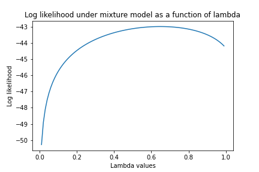

# Statistical-Language-Modeling

This project explores some simple statistical models of English text. The data files - unigram.txt and bigram.txt - contain unigram and bigram counts for 500 frequently occurring tokens in English text. These tokens include actual words as well as punctuation symbols and other textual markers. In addition, an ``unknown" token is used to represent all words that occur outside this basic vocabulary.

## Estimate of unigram distribution

The following table shows numerical unigram probabilities of all the tokens (i.e., words) that start with the letter “M”

| Tokens | Unigram Probabilities |
| --- | --- |
| MILLION | 0.0021 | 
| MORE | 0.0017 |
| MR. | 0.0014 |
| MOST | 0.0007 |
| MARKET | 0.0008 |
| MAY | 0.0007 |
| M. | 0.0007 |
| MANY | 0.0007 |
| MADE | 0.0006 |
| MUCH | 0.0005 |
| MAKE | 0.0005 |
| MONTH | 0.0004 |
| MONEY | 0.0004 |
| MONTHS | 0.0004 |
| MY | 0.0004 |
| MONDAY | 0.0004 |
| MAJOR | 0.0004 |
| MILITARY | 0.0004 |
| MEMBERS | 0.0003 |
| MIGHT | 0.0003 |
| MEETING | 0.0003 |
| MUST | 0.0003 |
| ME | 0.0003 |
| MARCH | 0.0003 |
| MAN | 0.0003 |
| MS. | 0.0002 |
| MINISTER | 0.0002 |
| MAKING | 0.0002 |
| MOVE | 0.0002 |
| MILES | 0.0002 |

## Estimate of bigram distribution

The following table shows the ten most likely words to follow the word “THE”, along with their numerical bigram probabilities.

| Most Likely Words | Bigram Probabilities |
| --- | --- |
| \<UNK\>  | 0.615 |
| U.  | 0.0134 |
| FIRST  | 0.0117 |
| COMPANY  | 0.0116 |
| NEW  | 0.0094 |
| UNITED  | 0.0087 |
| GOVERNMENT  | 0.0068 |
| NINETEEN  | 0.0066 |
| SAME  | 0.0063 |
| TWO  | 0.0062 |
  

## Log-likelihoods of sentences

| Sentence | Log-likelihood under unigram model | Log-likelihood under unigram model |
| --- | --- | --- |
| “The stock market fell by one hundred points last week.” | -64.509 | -40.918 |
| “The sixteen officials sold fire insurance.” | -44.292 | $-\infty$ (Bigrams (SIXTEEN, OFFICIALS) and (SOLD, FIRE) are not observed in the training corpus.) |

## Mixture model

Consider the so-called ${\it mixture}$ model that predicts words from a weighted interpolation of the unigram and bigram models:

$$P_m(w'|w) = \lambda P_u(w') + (1-\lambda) P_b(w'|w),$$

where $\lambda\in[0,1]$ determines how much weight is attached to each prediction. Under this mixture model, the log-likelihood of the sentence from previous section is given by:

$${\cal L}_m\ =\ \log\left[ 
  \begin{array}{c} \\ \end{array}
  P_m(\mbox{\bf the}|\langle \mbox{\bf s}\rangle)\ P_m(\mbox{\bf sixteen}|\mbox{\bf the})\ P_m(\mbox{\bf officials}|\mbox{\bf sixteen})\ \ldots\ P_m(\mbox{\bf fire}|\mbox{\bf sold})\ P_m(\mbox{\bf insurance}|\mbox{\bf fire})\ \right].$$

Plot of log-likelihood ${\cal L}_m$ as a function of the parameter $\lambda \in [0, 1]$ is as follows:

  
  
  

